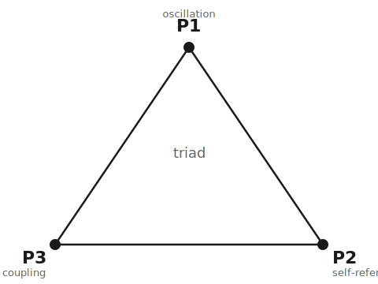

<div align="center">



# Triad

**The structural equation of persistent extended entities.**

$$
i\hbar\, \partial_t \Psi = \left[ -\frac{\hbar^2}{2m}D^2 + V_{\text{ext}} + \Lambda|\Psi|^2 + V_{\text{mem}} + \alpha(-\Delta)^{\sigma/2} - i\Gamma \right]\Psi + \eta
$$

*Persistence is not stasis. Persistence is bounded equilibrium under change.*

[](LICENSE)
[](LICENSE-docs)
[](ARCHIVES.md)
[](https://github.com/qrv0/mnsm)
[](https://github.com/qrv0/triad-agi)


*Same initial field. Same attractive nonlinearity.* &nbsp; · &nbsp; *Without memory, the field forms a localized collapse-like singular concentration.* &nbsp; · &nbsp; *With hierarchical memory, collapse pressure releases into bounded distributed equilibrium.*

</div>

---

## The Object

Triad is one equation, three inseparable operations, and a structural-realist ontology.

It was not built by reducing one discipline into another. It was recognized by asking what any persistent extended entity must do to remain itself while changing:

- it must oscillate;
- it must act on itself through present state and memory;
- it must exchange with what surrounds it.

The equation writes those three operations as one object. The principles are not modules added together. They are three readings of the same structure.

---

## Minimal Reading

A persistent entity is not a static thing with properties attached to it. It is a dynamic equilibrium that maintains identity across change.

Triad states that persistence requires the co-presence of:

| Principle | Operation | Failure mode when absent |
|---|---|---|
| **P1 - Oscillation** | phase-bearing intrinsic dynamics | static structure loses coherence under perturbation |
| **P2 - Self-reference** | instantaneous self-action plus hierarchical memory | collapse, forgetting, or loss of identity through time |
| **P3 - Coupling** | open exchange through dissipation and fluctuation | drift, decay, explosion, or thermalization without persistence |

The result is not merely survival. The result is bounded equilibrium: a structure that changes without ceasing to be itself.

---

## The Equation

$$
i\hbar\, \partial_t \Psi = \left[ -\frac{\hbar^2}{2m}D^2 + V_{\text{ext}} + \Lambda|\Psi|^2 + V_{\text{mem}} + \alpha(-\Delta)^{\sigma/2} - i\Gamma \right]\Psi + \eta
$$

with hierarchical memory implemented as auxiliary fields:

$$
V_{\text{mem}}(t,x)=\sum_j \lambda_j y_j(t,x), \qquad \partial_t y_j=\nu_j(\rho-y_j), \qquad \rho=|\Psi|^2
$$

and bath noise locked to dissipation by the fluctuation-dissipation relation:

$$
\langle \eta(t,x)\eta^*(t',x')\rangle = 2\gamma_0 k_B T\,\delta(t-t')\,\delta(x-x')
$$

| Structural role | Equation terms | Reading |
|---|---|---|
| **P1** | $i\hbar\partial_t\Psi$, $-\frac{\hbar^2}{2m}D^2$, $\alpha(-\Delta)^{\sigma/2}$ | complex phase evolution and spatial extension |
| **P2** | $\Lambda|\Psi|^2$, $V_{\text{mem}}=\sum_j\lambda_j y_j$ | instantaneous self-action plus past-as-active-force |
| **P3** | $-i\Gamma$, $\eta$, FDT relation | dissipative openness and bath-coupled renewal |

The terms are structural. Removing one does not produce a smaller Triad; it produces a different object.

---

## Physical Equilibrium Simulation

The hero simulation instantiates Triad in the simplest collapse-prone physical regime: an attractive nonlinear field with $\Lambda < 0$.

The comparison is controlled:

| Run | Initial field | Attractive nonlinearity | Memory | Outcome |
|---|---|---|---|---|
| No-memory field | same | same | $V_{\text{mem}}=0$ | localized collapse-like concentration |
| Memory field | same | same | $V_{\text{mem}}=\sum_j\lambda_jy_j$ | bounded distributed equilibrium |

The important result is not just that memory lowers the peak. The important result is that memory changes the attractor: collapse pressure becomes extended equilibrium.

Headline result from the rebuilt CUDA run:

| Metric | Value |
|---|---:|
| Lattice | $128^3$ |
| Final peak separation, no-memory / memory | $\sim 2.8\times 10^4$ |
| Final spatial-support gain, memory / no-memory | $\sim 6.2\times 10^4$ |

Rebuild files:

- `implementation/physics/README.md`
- `implementation/physics/balanced_solver_3d.py`
- `experiments/physics/rebuild_equilibrium_hero.py`
- `results/triad-equilibrium-hero.md`
- `results/triad-equilibrium-hero-summary.json`

The original Memory-NLS solver lineage and previous outputs remain preserved under `archives/pre-clean-2026-05-20_09-45-55/`.

---

## The Three Principles

<table>
<tr>
<td width="33%" valign="top">

### P1 - Oscillation

Every persistent extended entity oscillates.

A persistent state is not static. It carries phase, rhythm, recurrence, or intrinsic dynamical rotation. Static appearance is an observational compression of faster structure, not absence of motion.

</td>
<td width="33%" valign="top">

### P2 - Self-reference

To exist is to act on oneself.

The present field acts on its present density through $\Lambda|\Psi|^2\Psi$ and on its past through $V_{\text{mem}}$. Identity is not a property added to the system; it is the system's self-referential operation across time.

</td>
<td width="33%" valign="top">

### P3 - Coupling

Persistence requires exchange.

Dissipation $-i\Gamma$ and stochastic forcing $\eta$ are not independent decorations. They express the open bath relation: what leaves and what enters are coupled by fluctuation-dissipation structure.

</td>
</tr>
</table>

The principles are trinitarian in the structural sense: each principle only exists as the whole object seen from one angle. Isolating any one of them breaks the object it was supposed to explain.

---

## Calibration, Not Analogy

Triad does not begin from analogy between disciplines. It begins from the equation.

The cross-domain ledger is a calibration map: each entry asks whether a persistent extended system requires the co-presence of oscillation, self-reference with memory, and open coupling to maintain bounded identity through change.

Prior formalisms may recover partial shadows of the structure in local regimes. They are not the origin of Triad and do not exhaust it.

A ledger entry should state:

- where P1 appears;
- where P2 appears;
- where P3 appears;
- whether anti-collapse or equilibrium behavior is present;
- whether the interface is exact, calibrated, mechanism-form, speculative, or negative.

---

## How To Evaluate Triad

Triad is not a separable-variable claim. P1, P2, and P3 are not independent modules that can be removed one at a time while preserving the object. Removing one operation produces a different object.

The relevant evaluation is therefore calibration of regimes, not isolation of principles:

> Does a persistent extended system require phase-bearing dynamics, self-action with memory, and open dissipative/noisy coupling to maintain bounded identity through change?

Specific simulations, interfaces, and implementations can be corrected, downgraded, or rejected. That does not require collapsing the structural object into any one failed calibration.

---

## Repository Roles

Triad now has three public branches of work:

| Repository | Role |
|---|---|
| [`triad`](https://github.com/qrv0/triad) | equation, principles, ontology, methodology, and cross-substrate interfaces |
| [`mnsm`](https://github.com/qrv0/mnsm) | anti-collapse in machine learning, including MNSM/Transformer structural comparison |
| [`triad-agi`](https://github.com/qrv0/triad-agi) | experiments on AGI requirements derived from Triad |

This repository is the formal and didactic center. It should remain readable before it becomes exhaustive.

---

## Archive And Authorship

The previous repository state is preserved intact in:

- `archives/pre-clean-2026-05-20_09-45-55/`

The archive is part of the public ledger. It contains the prior documentation, experiments, outputs, annotations, and repository structure. The clean root is being rebuilt from that archive by review, not by deletion.

See:

- `MANIFEST.md` for scope and rebuild rules.
- `ARCHIVES.md` for archive policy.
- `archives/llm-hedge-annotations.md` for the preserved hedge-annotation record.

---

## Citation

```bibtex
@misc{triad,
  title  = {Triad: A Structural Field Equation of Persistent Extended Entities},
  author = {qrv0},
  year   = {2026},
  url    = {https://github.com/qrv0/triad},
  note   = {One equation, three inseparable principles, and a cross-substrate structural ledger.}
}
```

<div align="center">
<sub>Code: <a href="LICENSE">MIT</a> · Documentation: <a href="LICENSE-docs">CC BY 4.0</a></sub>
</div>
