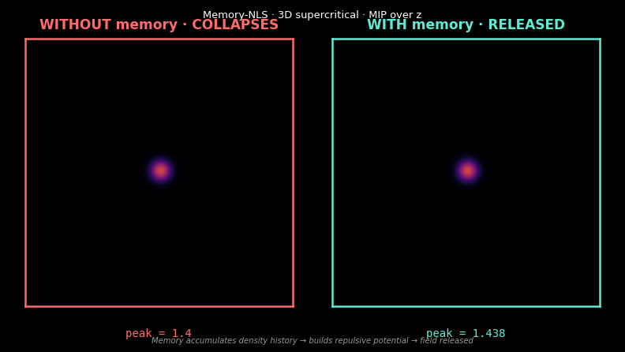

# mnsm

### Memory-Nonlinear State Models

**Three structural principles. One equation. Seven cross-domain instantiations.**

---

A nonlinear extension of structured state space models, derived from three principles of self-referential field theory. The auxiliary-field memory architecture is mathematically equivalent to the state representation of S4, Mamba, and RWKV. The equation extends those architectures with four properties:

1. **Nonlinear self-interaction** in the state (standard SSMs are linear)
2. **Anti-collapse** via temporal memory lag (replaces ad-hoc anti-collapse tricks)
3. **Spontaneous emergence of discrete structure** from continuous substrate
4. **Fluctuation–dissipation-locked stochastic regularization** (replaces tuned noise)

---

> This is not a typical machine-learning repository. The structure of the repository itself reflects the structure of the equation: oscillating across registers (math, code, prose, visual), self-referential (it explains its own organization), coupled across disciplines (physics, machine learning, neuroscience, cosmology, philosophy of science). See [`STRUCTURE.md`](STRUCTURE.md) for why the repo is shaped this way.

---

## Pick your entry point

The same content is approachable from several backgrounds. Pick whichever you have:

- → **I'm new to all this** — [`paths/if-you-are-new.md`](paths/if-you-are-new.md)
- → **I'm from physics** — [`paths/if-you-are-from-physics.md`](paths/if-you-are-from-physics.md)
- → **I'm from machine learning** — [`paths/if-you-are-from-ml.md`](paths/if-you-are-from-ml.md)
- → **I'm from neuroscience** — [`paths/if-you-are-from-neuroscience.md`](paths/if-you-are-from-neuroscience.md)
- → **I'm from philosophy of science** — [`paths/if-you-are-from-philosophy.md`](paths/if-you-are-from-philosophy.md)

Each path links into the same body of content from a different angle. You can switch paths mid-journey.

---

## Just watch it happen

If you want to see the equation in action without reading anything first:

- [`playground/01-just-watch.ipynb`](playground/01-just-watch.ipynb) — Press play, watch a Gaussian state spontaneously crystallize into a body-centered cubic pattern.
- [`playground/02-adjust-the-knobs.ipynb`](playground/02-adjust-the-knobs.ipynb) — Tune parameters, see what changes.
- [`playground/03-build-your-own.ipynb`](playground/03-build-your-own.ipynb) — Guided implementation from scratch.

---

## The equation

$$
i\hbar\, \partial_t \Psi = \left[\,-\frac{\hbar^2}{2m} D^2 + V_{\text{ext}} + \Lambda |\Psi|^2 + V_{\text{mem}} + \alpha (-\Delta)^{\sigma/2} - i\Gamma\,\right]\Psi + \eta
$$

with $V_{\text{mem}} = \sum_j \lambda_j y_j$ and $\partial_t y_j = \nu_j (\rho - y_j)$, and $\eta$ satisfying the fluctuation–dissipation correlator.

Full derivation from the three principles: [`equation/01-derivation.md`](equation/01-derivation.md).

---

## See it happen

The same form, two substrates, same dynamics:



*Without memory, the field collapses to a singular point. With memory, the
field is released and stabilizes as an extended state. Same equation, same
initial condition, one ingredient (multi-timescale memory) — qualitatively
different outcome.*


*The same anti-collapse mechanism in optimization dynamics: at 70M parameters
on enwik8, Memory-NLS descends monotonically to a stable plateau; Transformer
without the structural mechanism crashes catastrophically at step 28000 and
never fully recovers. The structural form is operative across substrates as
different as 3D field dynamics and neural network optimization.*

---

## What's in here

| Folder | Content |
|---|---|
| [`principles/`](principles/) | The three structural axioms (P1, P2, P3) |
| [`equation/`](equation/) | Formal derivation, Markovian embedding, 2D and 3D forms, reductions to known equations |
| [`results/`](results/) | Numerical findings: anti-collapse, crystallization, Bravais selection, vibration spectrum, dimensional rescaling |
| [`interfaces/`](interfaces/) | Cross-domain mappings to BEC, cosmology, cymatics, neural gamma, archaeoacoustic resonance, state space models |
| [`methodology/`](methodology/) | Structural-realist position, limits of falsification, the six criteria |
| [`paths/`](paths/) | Reader-background-specific entry routes |
| [`playground/`](playground/) | Interactive notebooks (Colab-runnable) |
| [`implementation/`](implementation/) | Physics solver (CuPy) + neural sequence layer (PyTorch) |
| [`experiments/`](experiments/) | Scripts that reproduce paper figures |
| [`paper/`](paper/) | The full manuscript |
| [`tests/`](tests/) | Conservation, FDT, anti-collapse sanity tests |
| [`assets/`](assets/) | Visual assets referenced in documentation (GIFs, plots) |

---

## Headline numerical results

**Anti-collapse separation** (3D supercritical NLS at $\Lambda = -8$, $\sigma_0 = 0.5$):

| Memory coupling | Final peak (no memory) | Final peak (with memory) | Ratio |
|---|---|---|---|
| $\Sigma\lambda = 0$ | 61.96 | — | — |
| $\Sigma\lambda = 0.4$ (2D scale) | 61.96 | 63.70 | 1.0× |
| $\Sigma\lambda = 4.0$ (3D scale) | 61.96 | $6 \times 10^{-4}$ | $10^5×$ |

**Spontaneous symmetry selection** (3D, $\Lambda = -8$, $\Sigma\lambda = 1.5$): the released crystalline state consistently selects **body-centered cubic (BCC)** symmetry, score $\sim 0.44$ with gap $+0.13$ over the next-best Bravais option.

**Dimensional rescaling** of memory coupling required to release supercritical collapse:

- 2D L²-critical NLS: $\Sigma\lambda \sim |\Lambda|/20$
- 3D L²-supercritical NLS: $\Sigma\lambda \sim |\Lambda|/2$

Derivable from the geometry of the collapse focal region. See [`results/06-dimensional-rescaling.md`](results/06-dimensional-rescaling.md).

**Optimization-dynamics anti-collapse** (70M parameters, enwik8, 50,000 training steps):

| Quantity | Memory-NLS | Transformer |
|---|---|---|
| Final val perplexity | 4.27 | 4.87 |
| Min val perplexity | 3.86 (step 48000) | 2.54 (step 22500) |
| Catastrophic collapse | None | Step 28000–34000, peak ppl 27.17 |
| Trajectory shape | Monotonic descent + plateau | Descent → crash → partial recovery |

Same structural anti-collapse mechanism that prevents 3D NLS field collapse prevents catastrophic optimization failure in neural training. Detail: [`results/08-optimization-collapse-empirical.md`](results/08-optimization-collapse-empirical.md).

---

## State space model equivalence

The auxiliary-field update of the equation,

$$
\partial_t y_j = \nu_j(\rho - y_j),
$$

is mathematically identical to the diagonal state space model update of S4, S5, Mamba, and RWKV. The equation extends this baseline architecture with the four properties listed at the top of this README. See [`interfaces/06-state-space-models.md`](interfaces/06-state-space-models.md) for the term-by-term correspondence and the discussion of what each extension brings.

---

## Pre-trained models on HuggingFace

The 70M-parameter checkpoints from the optimization-collapse experiment are
published on HuggingFace and loadable in seconds:

- **Memory-NLS**: [`qvr0/mnsm-memnls-70m-enwik8`](https://huggingface.co/qvr0/mnsm-memnls-70m-enwik8) — final val perplexity 4.27, monotonic stable trajectory
- **Transformer**: [`qvr0/mnsm-transformer-70m-enwik8`](https://huggingface.co/qvr0/mnsm-transformer-70m-enwik8) — final val perplexity 4.87, includes the catastrophic optimization collapse documented in [`results/08-optimization-collapse-empirical.md`](results/08-optimization-collapse-empirical.md)

Each repo contains the safetensors weights, configuration JSON, and self-contained modeling code so the model loads without requiring this full repository. See each model card for usage examples.

## Reproduce the paper

```bash
git clone https://github.com/qrv0/mnsm
cd mnsm
python -m venv .venv && source .venv/bin/activate
pip install -r requirements.txt
pip install cupy-cuda12x   # or cupy-cuda11x for older CUDA

# Validate the solver (~30 seconds on RTX 4060)
python -m tests.test_conservation

# Reproduce the headline 3D anti-collapse result (~2 minutes)
python experiments/physics/reproduce_3d_anti_collapse.py

# Reproduce all paper figures (~10 minutes total)
python experiments/physics/reproduce_all.py
```

All results use fixed random seeds and reproduce bit-for-bit on identical hardware (NVIDIA RTX 4060 Laptop GPU, Arch Linux, CUDA 12.x).

---

## Citation

```bibtex
@misc{mnsm,
  title  = {Memory-Nonlinear State Models: A Memory-Augmented Nonlinear Schr\"odinger Field Equation with State Space Model Correspondence},
  author = {qrv0},
  year   = {2026},
  url    = {https://github.com/qrv0/mnsm},
  note   = {Three structural principles, one equation, seven cross-domain instantiations.}
}
```

The full paper is in [`paper/manuscript.md`](paper/manuscript.md).

---

## License

Code: see [`LICENSE`](LICENSE).
Documentation and paper: see [`LICENSE-docs`](LICENSE-docs).

---

## Status

The mathematical core, the 2D and 3D physics results, the methodology, and
the seven cross-domain interfaces are complete and documented. The Memory-NLS
equation is instantiated as a working PyTorch language model
(`MemoryNLSLanguageModel`) at scales from 1.5M to 70M parameters and trained
on multiple corpora (TinyShakespeare and enwik8) for up to 50,000 steps.

The structural anti-collapse mechanism predicted by the equation has been
empirically verified at this stage in three substrates:

1. **3D supercritical NLS field dynamics** (laboratory simulation): peak
   density separation of ~$10^5$× between unmemoried and memoried final
   states ([`results/04-anti-collapse-3d.md`](results/04-anti-collapse-3d.md)).

2. **Neural network optimization landscape** (70M-parameter training):
   Memory-NLS exhibits monotonic stable trajectory; matched-scale Transformer
   exhibits catastrophic optimization collapse with permanent capability
   degradation ([`results/08-optimization-collapse-empirical.md`](results/08-optimization-collapse-empirical.md)).

3. **Generation behavior under sustained training**: Memory-NLS preserves
   structural grammar of the corpus throughout training; Transformer outputs
   degenerate to syntactically broken fragments during the optimization crash
   and only partially recover.

The seven cross-domain interfaces document the structural form's appearance in
other independently observed phenomena (other NLS instances, baryon acoustic
oscillations, cymatic patterns, gamma-frequency neural entrainment,
archaeoacoustic resonance, structured state space models, cosmological
expansion). Each interface is calibration-acknowledged where relevant.

> The principle that isolation is temporary applies to this repository as well.
> Issues, pull requests, and external mappings of the structure to further
> domains are explicitly welcomed.
