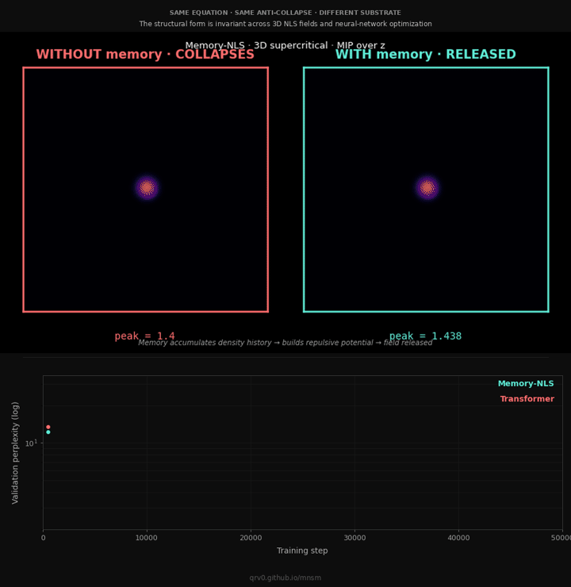

<div class="mnsm-hero" markdown>

<div class="mnsm-hero__visual" markdown>
<picture>
  <source media="(prefers-color-scheme: dark)" srcset="../_docs_assets/cross-domain-wheel-dark.svg">
  
</picture>
</div>

<div class="mnsm-hero__copy" markdown>

<div class="mnsm-eyebrow">Memory-Nonlinear State Models</div>

# Uma equação. Nove substratos.

Uma extensão não-linear de modelos de estado-espaço estruturados, derivada
de três princípios sobre entidades estendidas persistentes. A mesma forma
matemática aparece em física, cosmologia, redes neurais, e além, derivada
da observação, não montada a partir da literatura prévia.

<div class="mnsm-eq" markdown>
$$
i\hbar\, \partial_t \Psi
=
\left[\,-\tfrac{\hbar^{2}}{2m} D^{2} + V_{\text{ext}} + \Lambda |\Psi|^{2} + V_{\text{mem}} + \alpha\,(-\Delta)^{\sigma/2} - i\Gamma\,\right]\Psi + \eta
$$
</div>

<div class="eq-breakdown" markdown>
<div class="eq-term eq-term--p1" markdown>
<span class="eq-term-tag">P1 · Oscilação</span>
<span class="eq-term-math">$-\tfrac{\hbar^{2}}{2m}D^{2}$ ・ $\alpha(-\Delta)^{\sigma/2}$</span>
<span class="eq-term-desc">cinética de equação de onda + dispersão fracionária</span>
</div>
<div class="eq-term eq-term--p2" markdown>
<span class="eq-term-tag">P2 · Auto-referência</span>
<span class="eq-term-math">$\Lambda |\Psi|^{2}$ ・ $V_{\text{mem}}$</span>
<span class="eq-term-desc">auto-interação cúbica + hierarquia de memória de campo auxiliar</span>
</div>
<div class="eq-term eq-term--p3" markdown>
<span class="eq-term-tag">P3 · Acoplamento</span>
<span class="eq-term-math">$V_{\text{ext}}$ ・ $-i\Gamma$ ・ $\eta$</span>
<span class="eq-term-desc">potencial externo + par dissipação–ruído acoplado por FDT</span>
</div>
</div>

<div class="mnsm-cta" markdown>
[:material-play-circle-outline: Apenas observe](#veja-acontecer){ .md-button .md-button--primary }
[:material-book-open-page-variant-outline: Ler o paper](paper/manuscript.md){ .md-button }
[:material-download-outline: Usar o modelo](https://huggingface.co/qrv0/mnsm-memnls-70m-enwik8){ .md-button }
</div>

</div>

</div>

<div class="mnsm-section" markdown>

<div class="mnsm-section-head" markdown>
<span class="mnsm-section-tag">Fundamentos</span>
## Os três princípios
A equação é derivada destes. Não montada a partir da literatura prévia, derivada da observação sobre como entidades estendidas persistentes se comportam.
</div>

<div class="grid cards mnsm-principle-grid" markdown>

-   :material-sine-wave:{ .lg .middle } &nbsp; **P1 · Oscilação**

    ---

    Entidades estendidas persistentes oscilam. Existência em regime estacionário
    requer um equilíbrio entre avanço e restauração; o operador canônico é
    diferencial parcial de segunda ordem. Isto seleciona a forma de Schrödinger.

    [Ler P1 →](principles/01-oscillation.md)

-   :material-reflect-vertical:{ .lg .middle } &nbsp; **P2 · Auto-referência**

    ---

    Uma entidade persistente tem acesso aos seus próprios estados passados. A
    instanciação mínima é uma hierarquia de memória multi-escala indexada pelas
    taxas de relaxação τ, exatamente a atualização diagonal de SSM.

    [Ler P2 →](principles/02-self-reference.md)

-   :material-link-variant:{ .lg .middle } &nbsp; **P3 · Acoplamento**

    ---

    Isolamento é temporário; acoplamento é o padrão. Todo sistema persistente
    está conectado ao seu ambiente via flutuação–dissipação, não a despeito
    disso. Isto seleciona o termo estocástico η.

    [Ler P3 →](principles/03-coupling.md)

</div>

</div>

<div class="mnsm-section mnsm-section--alt" markdown>

<div class="mnsm-section-head" markdown>
<span class="mnsm-section-tag">Cross-Domain</span>
## Nove instanciações da mesma equação
Cada substrato produz independentemente a mesma forma matemática. A afirmação
é estrutural: a equação captura um padrão de comportamento persistente
invariante sob mudança de substrato.
</div>

<div class="grid cards mnsm-substrate-grid" markdown>

-   <span class="mnsm-substrate-sig sig--nls">:material-sine-wave:</span>
    <span class="mnsm-substrate-num">01 · Física</span>
    **Campos NLS**

    Condensados de Bose–Einstein, fibras ópticas, envelopes de ondas aquáticas:
    a equação de Schrödinger não-linear aparece sempre que um envelope
    lentamente variável governa um portador oscilatório.

    [→ Ler interface](interfaces/01-other-nls-systems.md)

-   <span class="mnsm-substrate-sig sig--bao">:material-star-four-points-outline:</span>
    <span class="mnsm-substrate-num">02 · Cosmologia</span>
    **Cosmologia BAO**

    Oscilações acústicas de bárions: uma onda de pressão modulada por memória
    no plasma primordial. A escala de 150 Mpc é o lock-in de um termo de memória.

    [→ Ler interface](interfaces/02-baryon-acoustic.md)

-   <span class="mnsm-substrate-sig sig--cym">:material-hexagon-multiple-outline:</span>
    <span class="mnsm-substrate-num">03 · Acústica</span>
    **Cimática de Chladni**

    Areia numa placa vibrante se auto-organiza em padrões nodais. Cristalização
    discreta a partir de substrato contínuo, mesmo mecanismo de seleção que o
    padrão BCC produzido pela equação em 3D.

    [→ Ler interface](interfaces/03-chladni-cymatics.md)

-   <span class="mnsm-substrate-sig sig--neuro">:material-brain:</span>
    <span class="mnsm-substrate-num">04 · Neuro</span>
    **Gama Neural**

    Entrainment cortical a 40 Hz na ligação cognitiva. A estrutura de memória
    temporal da equação corresponde à arquitetura multi-escala de hierarquias
    de oscilação neural.

    [→ Ler interface](interfaces/04-gamma-entrainment.md)

-   <span class="mnsm-substrate-sig sig--archeo">:material-pillar:</span>
    <span class="mnsm-substrate-num">05 · Acústica</span>
    **Arqueoacústica**

    Câmaras megalíticas de pedra (Hipogeu de Hal Saflieni, Newgrange) ressoam
    em frequências que coincidem com o espectro vibracional da equação. Mesma
    estrutura, substrato geológico.

    [→ Ler interface](interfaces/05-archaeoacoustic-resonance.md)

-   <span class="mnsm-substrate-sig sig--ssm">:material-grid:</span>
    <span class="mnsm-substrate-num">06 · ML</span>
    **Modelos de Estado-Espaço**

    A atualização de campo auxiliar é matematicamente idêntica à atualização
    diagonal de SSM de S4, S5, Mamba, e RWKV. A equação estende essa
    arquitetura com não-linearidade, anti-colapso, e ruído acoplado por FDT.

    [→ Ler interface](interfaces/06-state-space-models.md)

-   <span class="mnsm-substrate-sig sig--cosmo">:material-orbit-variant:</span>
    <span class="mnsm-substrate-num">07 · Cosmologia</span>
    **Expansão Cosmológica**

    Expansão de escala Hubble como uma liberação dirigida por memória a partir
    de colapso gravitacional. A constante cosmológica mapeia para um
    acoplamento de memória de longo prazo na formulação de campo auxiliar.

    [→ Ler interface](interfaces/07-cosmological-expansion.md)

-   <span class="mnsm-substrate-sig sig--interp">:material-magnify-scan:</span>
    <span class="mnsm-substrate-num">08 · ML / Interp</span>
    **Interpretabilidade Mecanística**

    Sistemas só de atenção não possuem a hierarquia de memória multi-escala
    de P2; o argumento estrutural prevê que devem codificar estrutura
    categórica como projeções superpostas, exatamente o que o programa de
    interpretabilidade da Anthropic recupera por decomposição esparsa.

    [→ Ler interface](interfaces/08-mechanistic-interpretability.md)

-   <span class="mnsm-substrate-sig sig--critical">:material-graph-outline:</span>
    <span class="mnsm-substrate-num">09 · Neuro / Criticalidade</span>
    **Cérebro Crítico**

    Avalanches neuronais, espectros 1/f, resposta de banda larga sem
    escala característica: a fenomenologia que a literatura do cérebro
    crítico documenta no córtex é a fenomenologia que a equação produz
    em seu regime cristalino de absorção banda larga, por forma
    estrutural e não por ajuste de parâmetros.

    [→ Ler interface](interfaces/09-critical-brain.md)

</div>

</div>

<div class="mnsm-section" markdown>

<div class="mnsm-section-head" markdown>
<span class="mnsm-section-tag">Empírico</span>
## O que ela faz
O mecanismo estrutural de anti-colapso predito pela equação foi
empiricamente verificado em três substratos até agora.
</div>

<div class="mnsm-results" markdown>

<div class="mnsm-result" markdown>
<div class="mnsm-result-figure">10<sup>5</sup>×</div>
<div class="mnsm-result-label">Separação anti-colapso</div>
<div class="mnsm-result-desc">Razão de densidade de pico entre estados finais sem memória e com memória em simulação NLS 3D supercrítica.</div>
<div class="mnsm-result-link"><a href="../results/04-anti-collapse-3d.md">Anti-colapso 3D →</a></div>
</div>

<div class="mnsm-result" markdown>
<div class="mnsm-result-figure">+0.13</div>
<div class="mnsm-result-label">Margem de seleção BCC</div>
<div class="mnsm-result-desc">O estado cristalino liberado seleciona espontaneamente simetria cúbica de corpo centrado sobre redes Bravais alternativas.</div>
<div class="mnsm-result-link"><a href="../results/05-bravais-selection.md">Cristalização →</a></div>
</div>

<div class="mnsm-result" markdown>
<div class="mnsm-result-figure">4.27</div>
<div class="mnsm-result-label">Perplexidade estável (70M)</div>
<div class="mnsm-result-desc">Memory-NLS a 70M parâmetros em enwik8 desce monotonicamente para um platô estável onde o Transformer de escala equivalente colapsa catastroficamente.</div>
<div class="mnsm-result-link"><a href="../results/08-optimization-collapse-empirical.md">Colapso de otimização →</a></div>
</div>

</div>

</div>

<div class="mnsm-section mnsm-section--demo" id="veja-acontecer" markdown>

<div class="mnsm-section-head" markdown>
<span class="mnsm-section-tag">Veja acontecer</span>
## Mesma equação, dois substratos, mesmo resultado
O campo físico 3D em cima, a trajetória de treinamento neural embaixo,
sincronizados no tempo. Ambos os painéis mostram o mecanismo de anti-colapso
predito pela equação, manifestando em substratos tão diferentes quanto uma
simulação de laboratório e um modelo de linguagem de 70M parâmetros.
</div>

<div class="mnsm-demo" markdown>
<div class="mnsm-demo-video" markdown>
<video class="mnsm-demo-media" autoplay loop muted playsinline
       poster="../assets/scale_up_val_ppl.png">
  <source src="../assets/cross_substrate_hero.mp4" type="video/mp4">
  
</video>

*<strong>Em cima:</strong> campo NLS 3D supercrítico. Painel esquerdo, sem
memória, o campo colapsa singularmente. Painel direito, com memória, o
campo é liberado e estabiliza. <strong>Embaixo:</strong> treinamento neural,
70M parâmetros em enwik8. O Transformer (vermelho) colapsa catastroficamente
no passo 28 000 onde o Memory-NLS (teal) mantém sua descida estável. Mesma
forma estrutural, dois substratos, sincronizados no tempo.*
</div>
</div>

</div>

<div class="mnsm-section mnsm-section--alt" markdown>

<div class="mnsm-section-head" markdown>
<span class="mnsm-section-tag">Trilhas de leitura</span>
## Escolha seu ponto de entrada
O mesmo conteúdo é abordável a partir de várias bases. Escolha a que você tiver.
</div>

<div class="grid cards mnsm-path-grid" markdown>

-   :material-account-outline:{ .middle } &nbsp; **Novo nisso tudo**

    Tour em linguagem simples pelos princípios e o que a equação faz, sem pré-requisitos.

    [Comece aqui →](paths/if-you-are-new.md)

-   :material-atom:{ .middle } &nbsp; **Da física**

    Forma de Schrödinger, correspondências BEC/ópticas, instanciação BAO, a questão metodológica.

    [Trilha de física →](paths/if-you-are-from-physics.md)

-   :material-chip:{ .middle } &nbsp; **De machine learning**

    Equivalência com modelos estado-espaço, anti-colapso, convolução FFT, o experimento de 70M.

    [Trilha de ML →](paths/if-you-are-from-ml.md)

-   :material-brain:{ .middle } &nbsp; **Da neurociência**

    Entrainment gama, hierarquias de memória, a arquitetura multi-escala da oscilação neural.

    [Trilha neuro →](paths/if-you-are-from-neuroscience.md)

-   :material-book-search-outline:{ .middle } &nbsp; **Da filosofia da ciência**

    Realismo estrutural, por que falsificação não é a lente certa aqui, os seis critérios.

    [Trilha de filosofia →](paths/if-you-are-from-philosophy.md)

</div>

</div>

<div class="mnsm-section mnsm-section--quiet" markdown>

<div class="mnsm-methodology" markdown>

<span class="mnsm-section-tag">Metodologia</span>

Este trabalho é avaliado por **critérios do realismo estrutural**, não por
testes de falsificação de quantidade única. Uma teoria cujo terceiro axioma
nega o isolamento não pode consistentemente ser avaliada por uma metodologia
que pressupõe a isolabilidade das variáveis. O enquadramento é documentado
adiantadamente porque o frame padrão de machine learning ("ganha do benchmark
X por Y%") e o frame padrão de física ("prediz a quantidade Q com precisão ε")
ambos perdem o que este trabalho é.

Os seis critérios que governam a avaliação: consistência matemática interna,
reprodutibilidade, escopo gerativo, coerência cross-domain, parcimônia,
abrangência.

[→ Por que realismo estrutural](methodology/01-structural-realism.md) ・
[→ Limites da falsificação](methodology/02-limits-of-falsification.md) ・
[→ Como avaliar isto](methodology/03-how-to-evaluate-this.md) ・
[→ Os seis critérios](methodology/04-the-six-criteria.md)

</div>

</div>

<div class="mnsm-footer-cite" markdown>

```bibtex
@misc{mnsm,
  title  = {Memory-Nonlinear State Models: A Memory-Augmented Nonlinear
            Schr\"odinger Field Equation with State Space Model Correspondence},
  author = {qrv0},
  year   = {2026},
  url    = {https://github.com/qrv0/mnsm},
  note   = {Three structural principles, one equation, nine cross-domain instantiations.}
}
```

</div>
