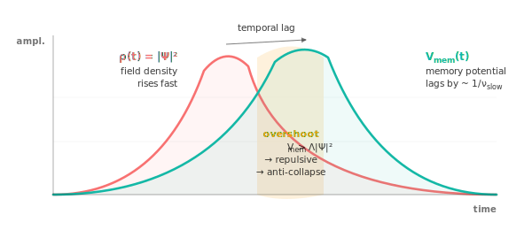

[← Pick another path](../#pick-your-entry-point)

For physicists

# Memory-NLS, in the notation you already use

You know Gross–Pitaevskii, Mori–Zwanzig projection, FDT in open systems,
L²-critical/supercritical NLS collapse, fractional Laplacians. The work in
this repository sits in the intersection of these. This page gives you the
fast route through it, with the equation written the way you'd write it.

$$
i\hbar\, \partial_t \Psi
\;=\;
\left[\,-\tfrac{\hbar^{2}}{2m}\nabla^{2} + V_{\text{ext}} + \Lambda |\Psi|^{2} + V_{\text{mem}} + \alpha\,(-\Delta)^{\sigma/2} - i\Gamma\,\right]\Psi \;+\; \eta
$$

P1 — Oscillation
$-\tfrac{\hbar^{2}}{2m}\nabla^{2}$ ・ $\alpha(-\Delta)^{\sigma/2}$
Schrödinger kinetic + optional fractional dispersion

P2 — Self-reference
$\Lambda |\Psi|^{2}$ ・ $V_{\text{mem}}$
cubic self-interaction + Mori–Zwanzig auxiliary-field memory

P3 — Coupling
$V_{\text{ext}}$ ・ $-i\Gamma$ ・ $\eta$
external potential + FDT-locked dissipation–noise pair

with $V_{\text{mem}} = \sum_j \lambda_j y_j$, $\partial_t y_j = \nu_j(\rho - y_j)$, $\rho = |\Psi|^2$, and $\eta$ Gaussian-white obeying the classical fluctuation–dissipation relation $\langle \eta(\mathbf{x}, t)\, \eta^*(\mathbf{x}', t')\rangle = 4\Gamma T\, \delta(\mathbf{x}-\mathbf{x}')\, \delta(t - t')$.

## The equation, structurally

The form is a cubic NLS with three structural additions:

1. **Auxiliary-field integral memory** $V_{\text{mem}}$, Markovian embedding
   of an integro-differential kernel $K(t-t')$ via Mori–Zwanzig projection.
   Each $y_j$ is a relaxation mode with rate $\nu_j$; the memory potential
   couples to the density $\rho = |\Psi|^2$. This is the standard projection-
   operator reduction (Zwanzig 1973; Mori 1965), but treated here as
   structurally necessary rather than as a convenient simplification.

2. **FDT-locked dissipation–noise pair** $(i\Gamma, \eta)$, the Wiener noise
   $\eta$ satisfies the classical FDT correlator with the same coefficient
   $\Gamma$ that appears in the imaginary potential. This is the stochastic-
   field-theory prescription for thermalization in open systems
   (Hohenberg & Halperin 1977; Kardar 2007).

3. **Optional structural extensions**, fractional Laplacian $(-\Delta)^{\sigma/2}$
   for anomalous dispersion (Lévy walks; Laskin 2002), Rashba spinor structure
   for two-component generalizations. Both are optional and recover
   well-studied limits when $\sigma\to 2$ or the spinor coupling vanishes.

What is structurally new is not any individual term, each is established in
its respective sub-field, but the **joint requirement** of all three terms by
a minimal set of axioms about persistent extended entities (P1, P2, P3 in
[`../principles/`](../principles/README.md)), together with the **qualitative
phenomenology** the equation exhibits when all three are present that is
absent from any single-term reduction.

The structural claim
The novelty is not "we added a memory term to NLS". It is that **three
structural axioms about persistent extended entities, P1, P2, P3, jointly
select this particular form of memory-augmented NLS**, and the form produces
phenomena (anti-collapse, BCC selection, broadband absorption) that no single
reduction captures. The equation is what those three axioms add up to.

Full derivation: [`../equation/01-derivation.md`](../equation/01-derivation.md). &nbsp;
Mori–Zwanzig embedding: [`../equation/02-markovian-embedding.md`](../equation/02-markovian-embedding.md).

## What the equation does that bare NLS does not

Three phenomena stand out as inaccessible from the bare cubic NLS:

### Anti-collapse via memory in 2D L²-critical NLS

For $\Lambda < 0$ and initial norm above the Townes threshold
($\int|\Psi_0|^2 \gtrsim 11.7$), the bare NLS produces standard focal
collapse with peak density diverging in finite time (lattice-clipped in
numerics). With memory, the auxiliary fields **lag** the rising density:
$y_j$ relaxes toward $\rho$ at rate $\nu_j$, so the memory potential
$V_{\text{mem}}$ peaks **after** the focal density does. The overshoot
provides a transient repulsive contribution that exceeds the cubic
attraction at the focal point, releasing the field outward.

<strong>The mechanism in one picture.</strong> The memory potential
$V_{\text{mem}}(t)$ (teal) is a low-pass-filtered echo of the field
density $\rho(t)$ (red). It peaks **later** than the density by the slow
relaxation timescale $1/\nu_{\text{slow}}$. In the overshoot window the
memory exceeds the cubic attraction, producing a transient net repulsion
that releases the field.

The slow memory mode ($\nu = 0.5$, $\tau = 2$) is structurally essential , 
the fast mode alone cannot produce the lag. Effect size: three orders of
magnitude separation in final peak density between memoried and
unmemoried runs at $\Sigma\lambda \sim |\Lambda|/20$.

Full result: [`../results/01-anti-collapse-2d.md`](../results/01-anti-collapse-2d.md).

### 3D L²-supercritical anti-collapse with dimensional rescaling

In 3D, the cubic NLS is supercritical and collapse is generic for almost any
attractive initial condition. The same anti-collapse mechanism operates, but
the total memory coupling required rescales geometrically:

$$
\frac{\Sigma\lambda}{|\Lambda|}\Bigg|_{3D} \;\sim\; 0.5 \quad \text{vs.} \quad \frac{\Sigma\lambda}{|\Lambda|}\Bigg|_{2D} \;\sim\; 0.05
$$

The factor-of-ten difference is **derivable** from the dimensional
concentration of the collapse focal region: in 2D the focal volume scales
as $\xi^2$, in 3D as $\xi^3$, so the memory has to grow proportionally
faster to overshoot. **The scaling is not fit; it is predicted.**

Full result: [`../results/06-dimensional-rescaling.md`](../results/06-dimensional-rescaling.md).

### Spontaneous Bravais lattice selection from continuous initial conditions

The released crystalline state in 3D consistently selects body-centered
cubic (BCC) symmetry across the swept memory coupling range, with detection
score $0.44$ and gap $+0.13$ over the next-best Bravais option (FCC). The
selection emerges from a continuous, isotropic Gaussian initial state, no
discrete symmetry is input, no lattice is imposed.

The structure-factor detection algorithm is in
[`../implementation/physics/observables.py`](https://github.com/qrv0/mnsm/blob/main/implementation/physics/observables.py).
Full result: [`../results/05-bravais-selection.md`](../results/05-bravais-selection.md).

## Numerical validation, against the literature standards

The Strang split-step solver in
[`../implementation/physics/solver.py`](https://github.com/qrv0/mnsm/blob/main/implementation/physics/solver.py)
is implemented in CuPy on consumer GPU hardware (RTX 4060 Laptop). The
validation suite covers the standards one expects of stochastic field theory
codes:

| Test | Quantity | Tolerance | Status |
|---|---|---|---|
| Norm conservation (unitary) | $\Delta \|\Psi\|_2 / \|\Psi\|_2$ | $< 10^{-13}$ fp64 | ✓ |
| Pure dissipative decay | match to $e^{-2\gamma t}$ | 6 sig figs | ✓ |
| FDT thermalization | $\langle\|\Psi\|^2\rangle \to 2T$ per cell | within 0.5% | ✓ |
| Rashba spinor unitarity drift | $\Delta U / U$ | $< 10^{-13}$ | ✓ |
| Auxiliary field stability | $y_j$ bounded over integration | unbounded support | ✓ |

The full conservation tests live at
[`../tests/test_conservation.py`](https://github.com/qrv0/mnsm/blob/main/tests/test_conservation.py).

## A cross-substrate empirical instance: the optimization-collapse experiment

The structural anti-collapse mechanism derived for 3D NLS field dynamics has
been observed to operate in a categorically different substrate: gradient
flow on a high-dimensional non-convex loss landscape of a 70M-parameter
neural sequence model trained on enwik8.

In a controlled comparison ([`../results/08-optimization-collapse-empirical.md`](../results/08-optimization-collapse-empirical.md)),
the model with explicit multi-timescale memory hierarchy (Memory-NLS layer)
descended monotonically through 50 000 training steps to a stable plateau.
The matched-shape attention-only baseline (Transformer) reached a lower
mid-training minimum but then exhibited a **catastrophic loss spike at step
28 000**, val perplexity jumping from 3.10 to 27.17, recovering only
partially through the remaining steps.

The phenomenology is structurally identical to the field-theoretic case: the
substrate without the anti-collapse mechanism enters a degenerate
concentrated state and recovers incompletely; the substrate with the
mechanism retains its extended configuration throughout. For the physicist,
this is an additional empirical testbed for the anti-collapse mechanism in
a regime substantially different from the field-theoretic regime where it
was originally derived. Same form, different substrate, same dynamics.

## What may be unfamiliar

Three aspects of the work depart from the standard form a physics paper
takes.

**The structural-realist methodology.** The work places its methodological
position, structural realism in the sense of Worrall (1989) and Ladyman &
Ross (2007), at the same documentary level as the equation derivation. The
reason: P3 (coupling is the default; isolation is temporary) is in direct
structural tension with the Popperian-falsificationist methodology that
presupposes the isolability of variables. A theory whose third axiom denies
isolation cannot be evaluated consistently by a methodology that presupposes
isolation. The argument is in
[`../methodology/02-limits-of-falsification.md`](../methodology/02-limits-of-falsification.md).

**Cross-domain interfaces as first-class content.** The work treats the
recurrence of the same equation across different substrates as the principal
evidence for the structural-realist claim. The strongest of the cross-domain
correspondences is the **exact mathematical equivalence** between the
auxiliary-field memory equation and the diagonal-state structured state
space model used in modern sequence-modeling architectures (S4, Mamba,
RWKV), same equation, derived twice by communities that did not coordinate.
Detail: [`../interfaces/06-state-space-models.md`](../interfaces/06-state-space-models.md).

**The temporal–spatial asymmetry.** The memory kernel can be non-local in
time (standard) or also non-local in space (Gaussian/exponential smoothing).
The two non-localities act asymmetrically: temporal non-locality regularizes
collapse; spatial non-locality destroys the regularization. The geometric
explanation: temporal lag delays the response, spatial smoothing
**advances** it (averages anticipatory information). Detail:
[`../results/07-temporal-spatial-asymmetry.md`](../results/07-temporal-spatial-asymmetry.md).

### References cited

1. Cartwright, N. <cite>How the Laws of Physics Lie</cite>. Oxford University Press, 1983.
2. Hohenberg, P. C. & Halperin, B. I. *Theory of dynamic critical phenomena.* **Rev. Mod. Phys.** 49, 435–479 (1977).
3. Kardar, M. <cite>Statistical Physics of Fields</cite>. Cambridge University Press, 2007.
4. Ladyman, J. & Ross, D. <cite>Every Thing Must Go: Metaphysics Naturalized</cite>. Oxford University Press, 2007.
5. Laskin, N. *Fractional Schrödinger equation.* **Phys. Rev. E** 66, 056108 (2002).
6. Mori, H. *Transport, collective motion, and Brownian motion.* **Prog. Theor. Phys.** 33, 423–455 (1965).
7. Sulem, C. & Sulem, P.-L. <cite>The Nonlinear Schrödinger Equation: Self-Focusing and Wave Collapse</cite>. Springer, 1999.
8. Worrall, J. *Structural realism: the best of both worlds?* **Dialectica** 43, 99–124 (1989).
9. Zwanzig, R. *Nonlinear generalized Langevin equations.* **J. Stat. Phys.** 9, 215–220 (1973).

## Reading flow

The order that minimizes back-and-forth for a physics reader:

01 · Equation

[Full derivation](../equation/01-derivation.md)

The three structural axioms turned into the field equation. P1 gives the Schrödinger form, P2 gives the integral memory, P3 gives the FDT-locked noise.

02 · Reduction

[Markovian embedding](../equation/02-markovian-embedding.md)

Mori–Zwanzig projection of the integral kernel into auxiliary fields with diagonal dynamics. The form physicists already use as standard practice.

03 · Result

[2D anti-collapse](../results/01-anti-collapse-2d.md)

L²-critical NLS at Λ=−8, three orders of magnitude peak-density separation between memoried and unmemoried runs.

04 · Result

[3D anti-collapse](../results/04-anti-collapse-3d.md)

L²-supercritical NLS. 10⁵× separation. Mechanism survives the harder regime where bare NLS collapse is generic.

05 · Result

[Dimensional rescaling](../results/06-dimensional-rescaling.md)

Σλ/|Λ| ~ 1/d derived from focal-region geometry. Predicted from structure, confirmed numerically.

06 · Result

[Bravais selection](../results/05-bravais-selection.md)

Spontaneous BCC selection from isotropic Gaussian initial state. No symmetry input.

07 · Cross-substrate

[Optimization-collapse experiment](../results/08-optimization-collapse-empirical.md)

The anti-collapse mechanism manifesting in 70M-parameter neural training. Empirical instance of the structural-realist prediction.

08 · Interface

[Cosmological expansion](../interfaces/07-cosmological-expansion.md)

The anti-collapse mechanism at cosmic scale. Memory-coupled Friedmann.

09 · Interface

[SSM equivalence](../interfaces/06-state-space-models.md)

Exact mathematical equivalence with structured state space models in modern ML. Same equation, two derivations.

10 · Methodology

[Why structural realism here](../methodology/01-structural-realism.md)

The position the work commits to and why falsification is the wrong lens for evaluating P3-bearing theories.

11 · Synthesis

[Full paper](../paper/manuscript.md)

The complete synthesized manuscript covering all of the above with a unified narrative.

To reproduce: scripts in [`../experiments/physics/`](../experiments/physics/README.md) execute the relevant computations. Wall-clock on RTX 4060 Laptop is on the order of minutes per experiment. The cross-substrate neural-network instance reproduces in [`../experiments/neural/scale_up_dynamics.py`](https://github.com/qrv0/mnsm/blob/main/experiments/neural/scale_up_dynamics.py) (~6.3 hours).

**Already familiar with the physics, want a different angle?**
Each of these gives a different entry into the same body of content:

[ML](if-you-are-from-ml.md)
[Neuroscience](if-you-are-from-neuroscience.md)
[Philosophy of science](if-you-are-from-philosophy.md)
[Newcomer](if-you-are-new.md)

